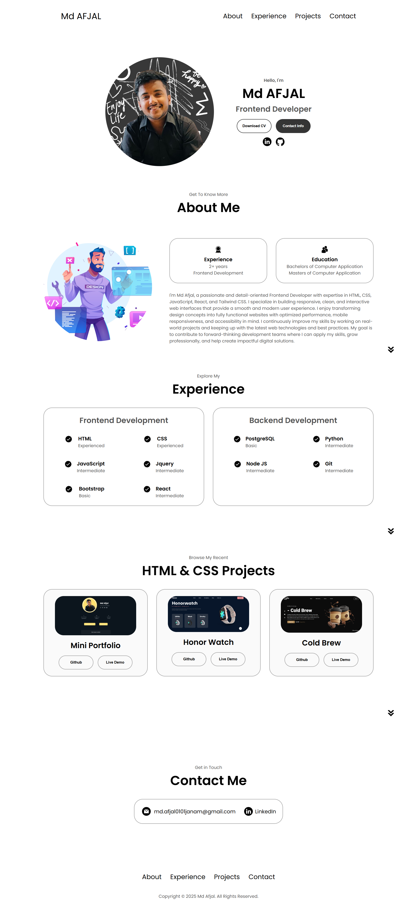

# Single Page Mini-Portfolio - 1
- This is a Clean and Responsive Personal Portfolio Website designed to Showcase my Skills, Projects and Contact Information.  
- The Site is built using fundamental Web Technologies, Ensuring a Fast and Lightweight Experience for Visitors & 
  this Website is a Single-Page Application that provides a Professional Overview of my Work and a Clear way for Potential Employers or Collaborators to Get in touch.

## Features

- Responsive Design : Optimized for a seamless experience on all devices, from desktops to mobile phones.

- Clear Sections : Dedicated sections for "About Me," "My Skills," "My Projects" and a "Contact Me" form.

- Smooth Navigation : The top navigation bar includes a mobile-friendly hamburger menu for easy access to all sections.

- Modern Aesthetics : A visually appealing and professional design to highlight your work effectively.

## Tech Stack

- HTML5: For structuring the content of the website.

- CSS3: For all styling, animations, and responsive design.

- JavaScript (ES6+): For interactivity, such as the mobile menu toggle and any other dynamic behaviors.

## Screenshots

Below is a Preview of **Single Page Mini-Portfolio - 1** , 
 
Showcasing the Layout and Styling implemented Using pure HTML and CSS. 
The Design focuses on Clean Structure, Responsiveness and Modern Styling.

